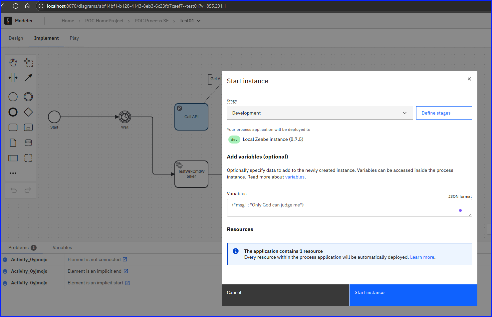
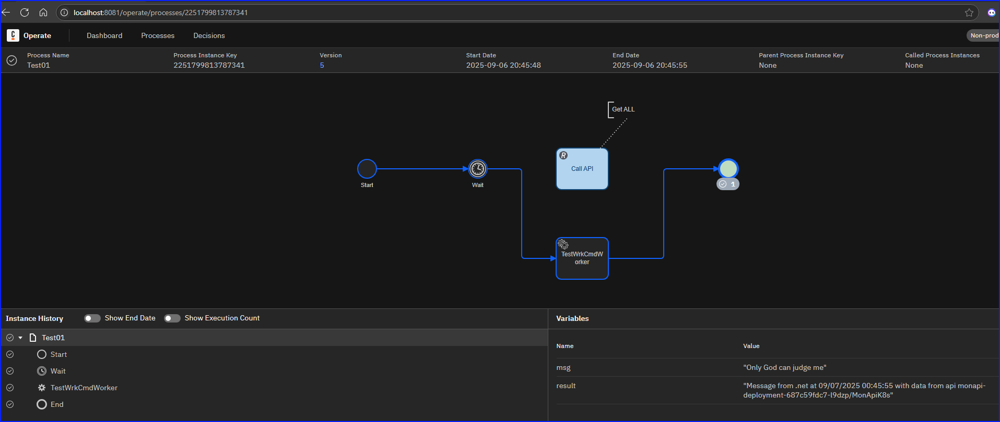
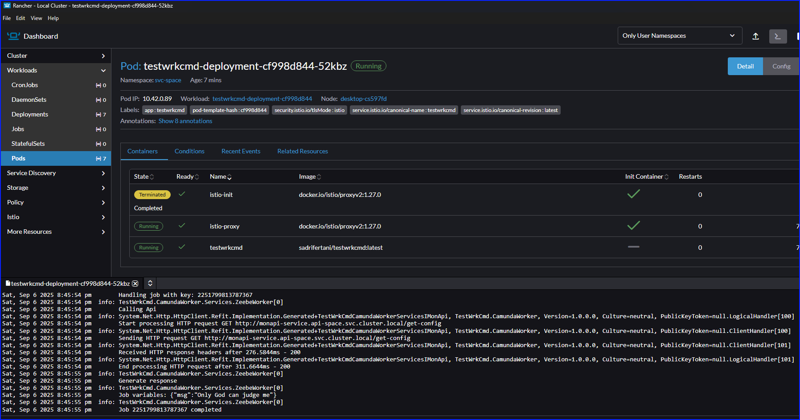
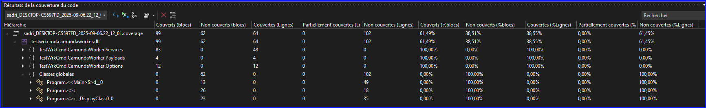

# Introduction
This is a POC how to bind Camunda *User Task* with c# Worker deployed on k8s (Rancher).

# Steps
## Step 0 : ngrok
Using ngrok is a better solution to establish communication between k8s node and host (localhost)
Exposing Zeebe (gRPC protocol)
```
ngrok tcp 26500
```

## Step 1 : Worker
Use *Microsoft.NET.Sdk.Worker* to create a *BackgroundService* 
https://learn.microsoft.com/en-us/dotnet/core/extensions/windows-service

## Step 2 : Model Camunda (Bpmn)
A simple modele having a *Task element* as *User Task*. This one must set JobType like defined in Worker.

## Step 3 : Helm
### Docker
```
docker build -t testwrkcmd:latest .
docker tag testwrkcmd:latest sadrifertani/testwrkcmd:latest
docker push sadrifertani/testwrkcmd:latest
```
### Create namespace
``` yml
apiVersion: v1
kind: Namespace
metadata:
  name: svc-space
  labels:
    name: svc-space
    istio-injection: enabled
```
```
kubectl apply -f namespace.yaml
```
### Deploy service
```
helm lint ./helm/testwrkcmd
helm install testwrkcmd ./helm/testwrkcmd -n svc-space
```
### Upgrade
```
helm upgrade testwrkcmd ./helm/testwrkcmd -n svc-space
```
### Uninstall
```
helm uninstall testwrkcmd -n svc-space
```
### Check node
```
kubectl get pods -n svc-space
```

### Test






## Extras
### Worker call api on k8s
#### Step 1 : Api on localhost
Api is deployed on k8s, but temporory port forward activated (For test)
#### Step 2 : Api on k8s
Remove forward : OK
### Code coverage
