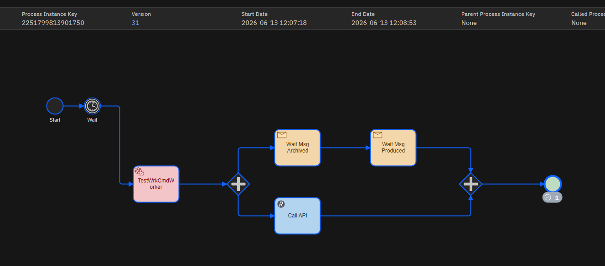

# Links
- Kafka UI : http://localhost:8080/ui/my-cluster/topic/TopicWorkerTest/data?sort=NEWEST&partition=All
- Modeler  : http://localhost:8070/login?returnUrl=/diagrams/abf14bf1-b128-4143-8eb3-6c23fb7caef7--test01
- Operate  : http://localhost:8081/operate/processes/2251799813895849

# Message Kafka Consumer
``` JSON
{
  "processInstanceKey" : "2251799813890677",
  "message" : "Hello Sadrouch",
  "status" : "Archived"
}
```

``` JSON
{
  "processInstanceKey" : "2251799813890677",
  "message" : "Hello Sadrouch",
  "status" : "Produced"
}
```

# Start process Camunda
```
cd .\TestWrkCmd.ProcessCamunda\
dotnet run --no-build
```

# Process execution


